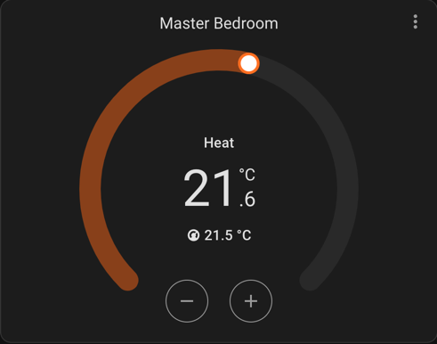

# Danfoss Icon Add-on

### Configuration parameters

| Parameter               | Description                                                                                                                                                                                                |
|-------------------------|------------------------------------------------------------------------------------------------------------------------------------------------------------------------------------------------------------|
| haUpdatePeriodInSeconds | How often Home Assistant will be updated with changes from Danfoss Icon master controller (default: 60 seconds).                                                                                           |
| sensorNameFmt           | Temperature values are exposed as HA states(sensors), here you can choose how they are named (using `Java` [String.Format()](https://docs.oracle.com/javase/21/docs/api/java/util/Formatter.html#syntax)). |
| port                    | HTTP port to use for add-on's embedded web server                                                                                                                                                          |
| mqttEnabled             | MQTT Home Assistant auto discovery is enabled                                                                                                                                                              |
| mqttHost                | Host of MQTT broker                                                                                                                                                                                        |
| mqttPort                | Port of MQTT broker                                                                                                                                                                                        |
| mqttKeepAlive           | MQTT keep alive interval in seconds                                                                                                                                                                        |
| mqttUsername            | Username to be used when connecting to MQTT broker                                                                                                                                                         |
| mqttPassword            | Password to be used when connecting to MQTT broker                                                                                                                                                         |
| logLevel                | Logger level (default: info)                                                                                                                                                                               |

## Setup climate devices in Home Assistant

It is enough to enable MQTT in add-on configuration and all house thermostats will be created in Home Assistant automatically.

If MQTT can't be used, it is possible to do setup climate devices in Home Assistant, but this requires more work and the following steps should be done:

### 1. Setting temperature

In order to set target temperature for thermostats from Home Assistant, main `configuration.yaml` should be updated, e.g.:

```yaml
rest_command:
  set_danfoss_home_temp:
    url: http://localhost:9199/command
    method: POST
    headers:
      accept: "application/json"
    payload: '{"command":"setHomeTemperature","value":{{ temperature }},"roomNumber":{{ roomNumber }}}'
    content_type: "application/json; charset=utf-8"
  set_danfoss_away_temp:
    url: http://localhost:9199/command
    method: POST
    headers:
      accept: "application/json"
    payload: '{"command":"setAwayTemperature","value":{{ temperature }},"roomNumber":{{ roomNumber }}}'
    content_type: "application/json; charset=utf-8"
```

This adds 2 rest commands which can be executed from scripts or automations, e.g.:

```yaml
service: rest_command.set_danfoss_home_temp
data:
  temperature: 22.5 # desired temperature.
  roomNumber: 3 # roomNumber is exposed as attribute in each danfoss temperature sensor entity.
```

### 2. Climate entity
After we defined rest command, we can set up climate entities and use thermostats in HA dashboards, f.i. using custom [Template Climate](https://github.com/jcwillox/hass-template-climate) integration.
The `configuration.yaml` could look like this (given our sensor is exposed as `sensor.danfoss_0_temperature`):

```yaml
climate:
  - platform: climate_template
    name: Master Bedroom Thermostat
    unique_id: danfoss_0_thermostat
    min_temp: 5
    max_temp: 35
    temp_step: 0.5
    modes:
      - "off"
      - "heat"
    hvac_mode_template: "{{ state_attr('sensor.danfoss_0_temperature', 'mode') }}"
    current_temperature_template: "{{ states('sensor.danfoss_0_temperature') }}"
    target_temperature_template: "{{ state_attr('sensor.danfoss_0_temperature', 'temperature_home') }}"
    set_temperature:
      service: rest_command.set_danfoss_home_temp
      data:
        temperature: "{{ temperature }}"
        roomNumber: "{{ state_attr('sensor.danfoss_0_temperature', 'room_number') }}"
```

The result:



## Donations

If this repository was useful to you and if you are willing to pay for it, feel free to send any amount through paypal:

[](https://paypal.me/soundvibe)